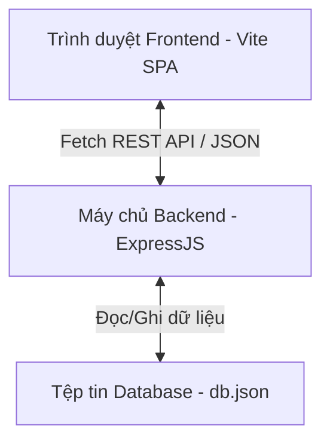

# Hướng dẫn Cài đặt & Vận hành Hệ thống Hồ sơ Thanh toán MobiFone (Client-Server)

Tài liệu này cung cấp hướng dẫn cài đặt chi tiết, cấu hình và kịch bản vận hành hệ thống **Tự động hóa & Đồng bộ dữ liệu Hồ sơ văn bản** theo mô hình Client-Server phục vụ cho MobiFone Cần Thơ.

---

## 1. Tổng quan Kiến trúc Hệ thống
Hệ thống được phát triển tách biệt thành hai thành phần chính nhằm nâng cao tính mở rộng, bảo mật và hiệu năng:



- **Frontend Client (Thư mục `/frontend`)**:
  - Giao diện SPA thuần, sử dụng thư viện icons Lucide và Font Inter chuyên nghiệp.
  - Phục vụ dev server bằng Vite, chạy trên cổng mặc định `5173`.
  - Quản lý tương tác người dùng, kéo thả file, hiển thị bảng so sánh Split Preview.
- **Backend Server (Thư mục `/backend`)**:
  - Viết trên nền tảng Node.js sử dụng Express framework, chạy trên cổng `5000`.
  - Quản lý trạng thái và hồ sơ thanh toán, lưu trực tiếp vào cơ sở dữ liệu tệp tin `db.json`.
  - Cung cấp các API RESTful để thực hiện nghiệp vụ quét tìm từ màu đỏ bằng biểu thức chính quy (Regex) và đồng bộ thay thế hàng loạt.

---

## 2. Yêu cầu Hệ thống (Prerequisites)
- **Node.js**: Phiên bản v18.0.0 trở lên.
- **Trình quản lý gói**: `npm` đi kèm Node.js.
- **Trình duyệt**: Bất kỳ trình duyệt web hiện đại nào (Chrome, Edge, Safari, Firefox).

---

## 3. Hướng dẫn chạy từng bước (Step-by-step)

Hệ thống yêu cầu chạy đồng thời **2 Terminal** độc lập.

### 3.1. Khởi động API Server Backend (Terminal 1)
1. Mở terminal, điều hướng vào thư mục backend:
   ```bash
   cd backend
   ```
2. Thực hiện cài đặt các dependencies:
   ```bash
   npm install
   ```
   *Kết quả mong đợi:* Terminal sẽ hoàn thành cài đặt các gói phụ thuộc mà không báo lỗi. Thư mục `node_modules/` sẽ được sinh ra ở `/backend`.
3. Chạy Server ở chế độ phát triển:
   ```bash
   npm run dev
   ```
   *Kết quả mong đợi:* Nodemon sẽ theo dõi các tệp tin và chạy `server.js`. Trên terminal hiển thị:
   ```text
   [nodemon] starting `node server.js`
   Backend API Server is running on port 5000
   ```

### 3.2. Khởi động Web App Frontend (Terminal 2)
1. Mở cửa sổ terminal thứ hai, điều hướng vào thư mục frontend:
   ```bash
   cd frontend
   ```
2. Cài đặt các gói phụ thuộc (bao gồm Vite dev server):
   ```bash
   npm install
   ```
   *Kết quả mong đợi:* Hoàn thành cài đặt công cụ Vite trong thư mục `frontend/node_modules/`.
3. Khởi chạy dev server phục vụ web:
   ```bash
   npm run dev
   ```
   *Kết quả mong đợi:* Vite khởi chạy và hiển thị địa chỉ truy cập localhost:
   ```text
     VITE v5.2.0  ready in 150 ms
     ➜  Local:   http://localhost:5173/
   ```
4. Click hoặc copy địa chỉ `http://localhost:5173/` dán vào trình duyệt để sử dụng ứng dụng.

---

## 4. Cấu hình biến môi trường (Configuration)
Hệ thống sử dụng các tệp tin cấu hình để thiết lập môi trường chạy cục bộ:
- **Tệp mẫu cấu hình**: [backend/.env.example](file:///d:/payment_records/backend/.env.example) chỉ chứa định nghĩa cổng hoạt động `PORT=5000`.
- **Tệp cấu hình thực tế**: [backend/.env](file:///d:/payment_records/backend/.env) được khởi tạo trống trên máy tính cá nhân để bảo mật thông tin nhạy cảm.

---

## 5. Kịch bản Kiểm thử & Demo Chức năng (Test Cases)

Hãy thực hiện theo quy trình kiểm thử từng bước dưới đây để kiểm nghiệm luồng hoạt động đồng bộ:

### Bước 1: Tạo Hồ sơ Thanh toán mới
1. Nhấp vào nút **"Tạo Hồ Sơ Mới"** (màu xanh dương trên thanh Header).
2. Khi modal mở ra, nhập tên: `"Hồ sơ thanh toán sửa chữa hạ tầng Cần Thơ Q2"` và nhấn **"Tạo hồ sơ"**.
3. **Kết quả mong đợi:** Xuất hiện Toast thông báo thành công màu xanh lục. Hồ sơ mới được hiển thị trên Sidebar bên trái và được tự động chọn. Kiểm tra tệp tin [backend/db.json](file:///d:/payment_records/backend/db.json) bạn sẽ thấy bản ghi hồ sơ mới đã được tạo với danh sách `files: []`.

### Bước 2: Nạp bộ tài liệu mẫu chuẩn MobiFone
1. Chọn hồ sơ vừa tạo, nhấp vào nút **"Nạp nhanh bộ tài liệu mẫu MobiFone"** ở vùng quản lý file.
2. **Kết quả mong đợi:** Xuất hiện Toast báo đã nạp thành công 3 tệp mẫu. Danh sách tài liệu hiển thị 3 file: `Hop_Dong_Dich_Vu_MobiFone_2026.txt`, `Bien_Ban_Nghiem_Thu_Ky_Thuat.txt` và `De_Nghi_Thanh_Toan_MobiFone.txt`.
3. Kiểm tra tệp tin `db.json`, 3 file này đã được lưu vào mảng `files` của hồ sơ tương ứng.

### Bước 3: Thực hiện Quét lỗi màu đỏ
1. Nhấp chọn nút **"Tiến hành quét tài liệu ngay"** ở bảng điều khiển trung tâm.
2. **Kết quả mong đợi:** Hiệu ứng thanh tiến trình (progress bar) hiển thị chạy từ 0% đến 100% kèm các nhãn trạng thái quét OCR.
3. Khi chạy xong, xuất hiện Toast báo hoàn thành và hiển thị bảng liệt kê 3 từ màu đỏ được phát hiện chung trên các tài liệu:
   - `0100686209-009` (Xuất hiện ở cả 3 file).
   - `123/45 Đường Trần Hưng Đạo, Quận Ninh Kiều, TP. Cần Thơ` (Xuất hiện ở cả 3 file).
   - `Ngân hàng TMCP Ngoại thương Việt Nam - CN Cần Thơ (Vietcombank)` (Xuất hiện ở cả 3 file).

### Bước 4: Đồng bộ hóa & Thay thế hàng loạt
1. Tại bảng danh sách lỗi phát hiện, tiến hành nhập các cụm từ chuẩn hóa thay thế tương ứng:
   - Nhập `0100686209-009 (Đã khớp)` thay thế cho Mã số thuế.
   - Nhập `123/45 Trần Hưng Đạo, Ninh Kiều, Cần Thơ` thay thế cho Địa chỉ.
   - Nhập `Vietcombank Chi nhánh Cần Thơ` thay thế cho Tên ngân hàng.
2. Đảm bảo checkbox **"Đồng bộ tất cả"** ở các hàng được tích chọn.
3. Nhấp vào nút **"Áp dụng & Đồng bộ hàng loạt"**.
4. **Kết quả mong đợi:** Hệ thống gọi API gửi mảng thay thế lên Backend. Backend cập nhật nội dung văn bản gốc, chuyển các nhãn `[RED:...]` thành `[GREEN:...]` trên toàn bộ các file được chỉ định, sau đó lưu trạng thái hồ sơ thành `completed`. Toast báo sửa đổi thành công xuất hiện, các badge trạng thái chuyển sang màu xanh lá `"Đã đồng bộ"`.

### Bước 5: Kiểm tra kết quả (Split Preview) & Xuất bản ghi
1. Cuộn chuột xuống khối cuối cùng: **"Trình Xem Trước & Xuất Bản Ghi Hoàn Chỉnh"**.
2. Chọn từng file ở thanh Dropdown để xem trước.
3. **Kết quả mong đợi:**
   - Cột trái hiển thị văn bản cũ chứa các lỗi được highlight nền đỏ.
   - Cột phải hiển thị văn bản mới đã được đồng bộ thay thế thành công, highlight nền xanh lá.
4. Bấm nút **"Xuất Hồ Sơ Hoàn Chỉnh (.TXT)"**. Trình duyệt sẽ tải về máy tính file văn bản hoàn chỉnh sạch sẽ (không còn các tag định dạng), sẵn sàng sử dụng thực tế.
